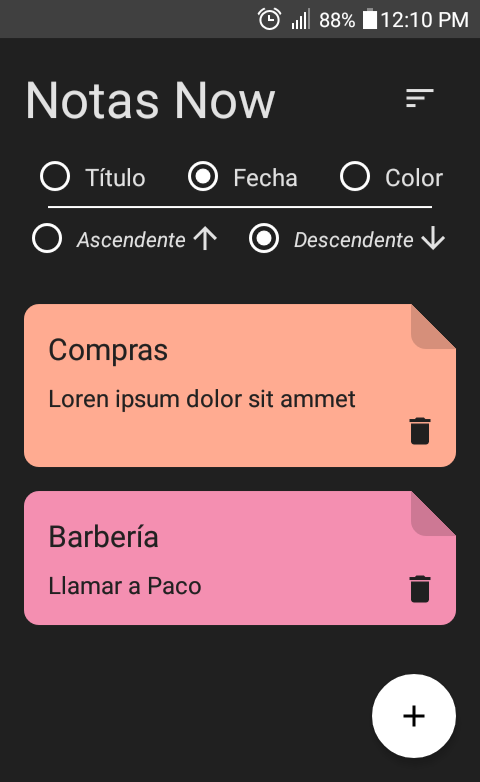

# ToDo Android Application using Jetpack Compose and Clean Arch.

### Main screen


### Add-Edit screen


## Installation
Clone this repository and import into **Android Studio**
```bash
git clone git@github.com:orlandroyd/<reponame>.git
```

## Build variants
Use the Android Studio *Build Variants* button to choose between **production** and **staging** flavors combined with debug and release build types

## Generating signed APK
From Android Studio:
1. ***Build*** menu
2. ***Generate Signed APK...***
3. Fill in the keystore information *(you only need to do this once manually and then let Android Studio remember it)*

## Maintainers
This project is mantained by:
* [Orlando Peña Fernández](http://github.com/orlandroyd)

## Contributing
1. Fork it
2. Create your feature branch (git checkout -b my-new-feature)
3. Commit your changes (git commit -m 'Add some feature')
4. Run the linter (ruby lint.rb').
5. Push your branch (git push origin my-new-feature)
6. Create a new Pull Request
